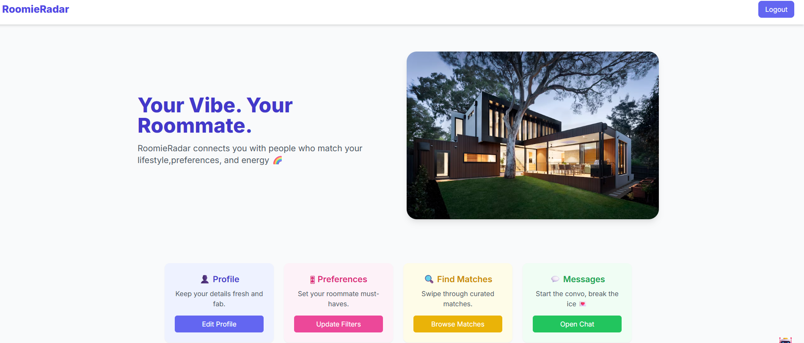
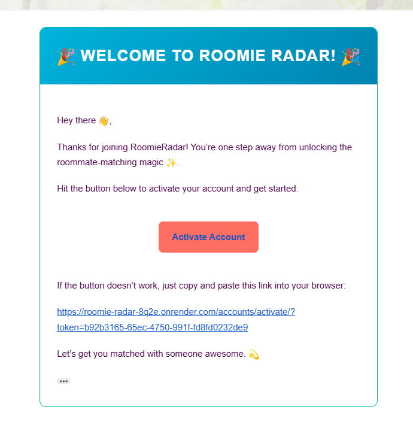

<p align="center">
  
  
  
</p>

<h1 align="center">🏠 RoomieRadar</h1>

<p align="center">
  <em>Find your perfect roommate with a modern, vibe-based matching platform</em>
</p>

---

## 🌟 Demo

<p align="center">
  🔗 <a href="https://roomie-radar-8q2e.onrender.com"><strong>👉 Live Demo 👈</strong></a>  
  🎥 <a href="https://drive.google.com/file/d/1drgeIdNdQBZISA0BN1BR_8OZiCobIZNJ/view?usp=sharing"><strong>📽 Watch Demo Video</strong></a>  
</p>

---

## 🚀 Features
- 🔐 **Secure Authentication** — Sign up, login, email verification  
- 👤 **Profile Management** — Bio, profile pic, roommate preferences  
- 🎯 **Match Suggestions** — Smart matching based on compatibility  
- 💬 **Messaging System** — Chat between matched roommates  
- 🤖 **AI Chatbot Assistant** — Friendly guide to help navigate the platform  

---

## ⚡ Tech Stack
| Layer       | Tech Used                      |
|-------------|--------------------------------|
| Backend     | Django (Python)                |
| Frontend    | Tailwind CSS, JavaScript, HTML |
| Database    | SQLite (dev) / PostgreSQL (prod) |
| Deployment  | Render                         |

---

## 📸 Screenshots

<p align="center">
  
</p>

<p align="center">
  
</p>

<p align="center">
  
</p>

<p align="center">
  
</p>

---

## 👩‍💻 Authors
- **K. Niveditha** — Full Stack Developer  
- **Shaik Heena Parveen** — Tester  

---

## 📂 Installation & Setup

```bash
# Clone the project
git clone https://github.com/nivedithakummetha63/DjangoProject.git
cd DjangoProject

# Create & activate virtual environment
python -m venv env
source env/bin/activate   # On Windows: env\Scripts\activate

# Install dependencies
pip install -r requirements.txt

# Run migrations
python manage.py migrate

# Start development server
python manage.py runserver
